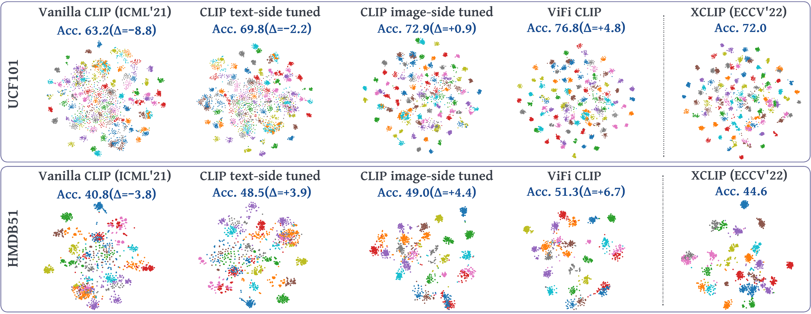

# Fine-tuned CLIP models are efficient video learners [CVPR 2023]


> [**Fine-tuned CLIP models are efficient video learners**](https://arxiv.org/abs/2212.03640)<br>
> [Hanoona Rasheed*](https://scholar.google.com/citations?user=yhDdEuEAAAAJ&hl=en&authuser=1&oi=sra), [Muhammad Uzair Khattak*](https://scholar.google.com/citations?user=M6fFL4gAAAAJ&hl=en&authuser=1), [Muhammad Maaz](https://scholar.google.com/citations?user=vTy9Te8AAAAJ&hl=en&authuser=1&oi=sra), [Salman Khan](https://salman-h-khan.github.io/), [Fahad Shahbaz Khan](https://scholar.google.es/citations?user=zvaeYnUAAAAJ&hl=en)

*Equally contributing first authors

[](https://muzairkhattak.github.io/ViFi-CLIP/)
[](https://arxiv.org/abs/2212.03640)
[](https://www.youtube.com/watch?v=uqPLPIyWBb0)
[](https://drive.google.com/file/d/1_CITKY9u_Fh77iqQDP2TrcbVD5_61ArT/view?usp=sharing)
[](https://github.com/muzairkhattak/ViFi-CLIP/blob/main/ViFi-CLIP_Inference_custom_video.ipynb)

Official implementation of the paper "[Fine-tuned CLIP models are efficient video learners](https://arxiv.org/abs/2212.03640)".
<hr />

[//]: # ([![PWC]&#40;https://img.shields.io/endpoint.svg?url=https://paperswithcode.com/badge/maple-multi-modal-prompt-learning/prompt-engineering-on-imagenet&#41;]&#40;https://paperswithcode.com/sota/prompt-engineering-on-imagenet?p=maple-multi-modal-prompt-learning&#41;)

[//]: # ([![PWC]&#40;https://img.shields.io/endpoint.svg?url=https://paperswithcode.com/badge/maple-multi-modal-prompt-learning/prompt-engineering-on-sun397&#41;]&#40;https://paperswithcode.com/sota/prompt-engineering-on-sun397?p=maple-multi-modal-prompt-learning&#41;)

[//]: # ([![PWC]&#40;https://img.shields.io/endpoint.svg?url=https://paperswithcode.com/badge/maple-multi-modal-prompt-learning/prompt-engineering-on-eurosat&#41;]&#40;https://paperswithcode.com/sota/prompt-engineering-on-eurosat?p=maple-multi-modal-prompt-learning&#41;)

[//]: # ([![PWC]&#40;https://img.shields.io/endpoint.svg?url=https://paperswithcode.com/badge/maple-multi-modal-prompt-learning/prompt-engineering-on-ucf101&#41;]&#40;https://paperswithcode.com/sota/prompt-engineering-on-ucf101?p=maple-multi-modal-prompt-learning&#41;)

[//]: # ([![PWC]&#40;https://img.shields.io/endpoint.svg?url=https://paperswithcode.com/badge/maple-multi-modal-prompt-learning/prompt-engineering-on-fgvc-aircraft&#41;]&#40;https://paperswithcode.com/sota/prompt-engineering-on-fgvc-aircraft?p=maple-multi-modal-prompt-learning&#41;)

[//]: # ()
[//]: # ()
[//]: # (<hr />)

# :rocket: News
* **(Nov 24, 2023)**
  * Interactive notebook released. Inference with ViFi-CLIP on custom videos without significant installation dependencies!
* **(Feb 28, 2023)**
  * Paper accepted at CVPR 2023 :tada: 
* **(Dec 6, 2022)** 
  * Training and evaluation codes for [ViFi-CLIP](https://arxiv.org/abs/2212.03640), along with pretrained models are released.
  
<hr />

## Highlights


<p align="justify">  This work explores the capability of a simple baseline called ViFi-CLIP (Video Fine-tuned CLIP)
for adapting image pretrained CLIP to video domain. The figure compares the zero-shot performance of vanilla CLIP
and several of its variants adapted for videos (trained on Kinetics-400, evaluated on UCF-101 and HMDB-51).
The t-SNE visualizations of video-embeddings obtained from ViFi-CLIP (4th col.) are compared with embeddings
from vanilla CLIP (1st col.), individually tuned CLIP text (2nd col.) and image encoder (3rd col.) on videos,
and recent state-of-the-art work, XCLIP (last col.) (∆ represents difference over XCLIP). The embeddings of
ViFi-CLIP are better separable, indicating that a simple fine-tuning of CLIP is sufficient to learn suitable 
video-specific inductive biases, and can perform competitive to more complex approaches having dedicated components 
designed to model temporal information in videos. </p>


> **<p align="justify"> Abstract:** *Large-scale multi-modal training with image-text pairs imparts
> strong generalization to CLIP model. Since training on a similar scale for videos is infeasible,
> recent approaches focus on the effective transfer of image-based CLIP to the video domain. In this 
> pursuit, new parametric modules are added to learn temporal information and inter-frame relationships
> which require meticulous design efforts. Furthermore, when the resulting models are learned on videos
> , they tend to overfit on the given task distribution and lack in generalization aspect. This begs the
> following question: How to effectively transfer image-level CLIP representations to videos? In this work,
> we show that a simple Video Fine-tuned CLIP (ViFi-CLIP) baseline is generally sufficient to bridge the
> domain gap from images to videos. Our qualitative analysis illustrates that the frame-level processing 
> from CLIP image-encoder followed by feature pooling and similarity matching with corresponding text 
> embeddings helps in implicitly modeling the temporal cues within ViFi-CLIP. Such fine-tuning helps
> the model to focus on scene dynamics, moving objects and inter-object relationships. For low-data 
> regimes where full fine-tuning is not viable, we propose a `bridge and prompt' approach that first
> uses fine-tuning to bridge the domain gap and then learns prompts on language and vision side to 
> adapt CLIP representations. We extensively evaluate this simple yet strong baseline on zero-shot,
> base-to-novel generalization, few-shot and fully supervised settings across five video benchmarks.* </p>

## Main Contributions

1) **ViFi-CLIP:** We formulate and show the significance of an often neglected but
simple baseline for transferring image-based CLIP model to video domain. ViFi-CLIP (Video Fine-tuned CLIP) shows that a simple fine-tuning of CLIP is sufficient to learn suitable video-specific inductive biases,
and can perform competitive to more complex approaches having dedicated components designed to model temporal information in videos.
2) **Base-to-novel generalization benchmark:** We introduce base-to-novel generalization benchmark for video-domain for evaluating the generalization ability of models for video action recognition.
3) **Bridge and Prompt approach:** We show the effectiveness of our proposed ‘bridge and prompt’ approach to first bridge the modality gap through fine-tuning followed by prompt learning in both visual and language branches of the CLIP model
for low-data regimes.

   
# Model Zoo
NOTE: All models in our experiments below uses publicly available ViT/B-16 based CLIP model. The trained model weights against each experiment is provided in tables below.

### Zero-shot results
All models are trained on Kinetics-400 and then evaluated directly on downstream datasets.

| Name  (configs)                                                           | Input  | HMDB-51 | UCF-101 | Kinetics-600 |                                                                    Model                                                                     |
|---------------------------------------------------------------------------|:------:|:-------:|:-------:|:------------:|:--------------------------------------------------------------------------------------------------------------------------------------------:|
| [CLIP image-FT](configs/zero_shot/train/k400/16_16_image_tuned_clip.yaml) | 32x224 |  49.0   |  72.9   |     62.2     | [link](https://mbzuaiac-my.sharepoint.com/:u:/g/personal/uzair_khattak_mbzuai_ac_ae/EdA6n7TCQEFAse5X1g1I08AByLCWHM69axTyK9OyVZy86Q?e=NaipU1) |
| [CLIP text-FT](configs/zero_shot/train/k400/16_16_text_tuned_clip.yaml)   | 32x224 |  48.5   |  69.8   |     68.5     | [link](https://mbzuaiac-my.sharepoint.com/:u:/g/personal/uzair_khattak_mbzuai_ac_ae/Eea6hW-_RBdJo4T5JJ_sWgEBNGFdA91tPTq9MQ-XkO5dMg?e=hGneeQ) |
| [ViFi-CLIP](configs/zero_shot/train/k400/16_16_vifi_clip.yaml)            | 32x224 |  51.3   |  76.8   |     71.2     | [link](https://mbzuaiac-my.sharepoint.com/:u:/g/personal/uzair_khattak_mbzuai_ac_ae/EW0shb6XYDxFi3BH6DT70rgBPDwgW_knQ8jDsarxINXezw?e=RbixXc) |


### Base-to-novel generalization results
Here, we divide each dataset into base and novel classes.
All models are trained on base classes and evaluated on both base and novel classes. Results are averaged over 3 seeds for each experiment.

#### Kinetics-400
| Name  (configs)                                                | Input  | Base Acc. | Novel Acc. |  HM  |                                                                                                                                                                                                                   Model                                                                                                                                                                                                                   |
|----------------------------------------------------------------|:------:|:---------:|:----------:|:----:|:-----------------------------------------------------------------------------------------------------------------------------------------------------------------------------------------------------------------------------------------------------------------------------------------------------------------------------------------------------------------------------------------------------------------------------------------:|
| [CLIP image-FT](configs/base2novel/finetuning_base2novel/k400) | 32x224 |   72.9    |    58.0    | 64.6 | [seed1](https://mbzuaiac-my.sharepoint.com/:u:/g/personal/uzair_khattak_mbzuai_ac_ae/EXaQGUrODN9DjxtWuSylHJIBbFtAimZHdubKSHPlTT79eg?e=WiNFM9)/[seed2](https://mbzuaiac-my.sharepoint.com/:u:/g/personal/uzair_khattak_mbzuai_ac_ae/ESKX8BXvQoBHn5jq04EoowEB0zR6iPxlkxjSuWJbHupceg?e=vDniMa)/[seed3](https://mbzuaiac-my.sharepoint.com/:u:/g/personal/uzair_khattak_mbzuai_ac_ae/Ed1D7oXTF6VKtAVSleSJHowBJxsdu1kNNDRk4LBGOfzokg?e=gqt8en) |
| [CLIP text-FT](configs/base2novel/finetuning_base2novel/k400)  | 32x224 |   73.4    |    59.7    | 65.8 | [seed1](https://mbzuaiac-my.sharepoint.com/:u:/g/personal/uzair_khattak_mbzuai_ac_ae/EduVCGSp11tFlwyCKg5ee7wBMJQwGHN9gKNBJozpZCgPEg?e=NPeIjf)/[seed2](https://mbzuaiac-my.sharepoint.com/:u:/g/personal/uzair_khattak_mbzuai_ac_ae/ERw9FPot9T9PrVw0kxdsQvkBcpDuDYYUnIFLTjm_xqz8zA?e=8dkLY8)/[seed3](https://mbzuaiac-my.sharepoint.com/:u:/g/personal/uzair_khattak_mbzuai_ac_ae/EU1lFXfDColIuYqGRrujImwBVqz2vP5gpTAM446HPa7erA?e=MCcZ6t) |
| [ViFi-CLIP](configs/base2novel/finetuning_base2novel/k400)     | 32x224 |   76.4    |    61.1    | 67.9 | [seed1](https://mbzuaiac-my.sharepoint.com/:u:/g/personal/uzair_khattak_mbzuai_ac_ae/EVEyFxODEvtFt6FVpuIQvNQBgi5bfxce_nqgzqsjuxB48g?e=rOAu0o)/[seed2](https://mbzuaiac-my.sharepoint.com/:u:/g/personal/uzair_khattak_mbzuai_ac_ae/EcCHHh5FvnlPnlQTHLUk2v0Bv6MMTWHpkluBiQ1MdbZWFA?e=d3NkTX)/[seed3](https://mbzuaiac-my.sharepoint.com/:u:/g/personal/uzair_khattak_mbzuai_ac_ae/ETG_gS_l-E1Ai6BkPq8WlzgB8L5PDYDoVrgzia9832j3wg?e=rfJzPs) |

#### HMDB-51
| Name  (configs)                                                | Input  | Base Acc. | Novel Acc. |  HM  |                                                                                                                                                                                                                   Model                                                                                                                                                                                                                   |
|----------------------------------------------------------------|:------:|:---------:|:----------:|:----:|:-----------------------------------------------------------------------------------------------------------------------------------------------------------------------------------------------------------------------------------------------------------------------------------------------------------------------------------------------------------------------------------------------------------------------------------------:|
| [CLIP image-FT](configs/base2novel/finetuning_base2novel/hmdb) | 32x224 |   62.6    |    47.5    | 54.0 | [seed1](https://mbzuaiac-my.sharepoint.com/:u:/g/personal/uzair_khattak_mbzuai_ac_ae/EVNYYAhsZtZMtzoQcfKx7rQBlrEYkvUyDVfauuMobgAA0g?e=GQ2D8z)/[seed2](https://mbzuaiac-my.sharepoint.com/:u:/g/personal/uzair_khattak_mbzuai_ac_ae/EQaX5EzlLfhGhbZEzsgST0cB4HD0saOuoYgBCW7K8bzaBg?e=tKNkqY)/[seed3](https://mbzuaiac-my.sharepoint.com/:u:/g/personal/uzair_khattak_mbzuai_ac_ae/EUiGmlJa3M9Fgx6epCvPiRkBtkON4YKMWEtQSkwqC3dXWw?e=72DTbt) |
| [CLIP text-FT](configs/base2novel/finetuning_base2novel/hmdb)  | 32x224 |   70.0    |    51.2    | 59.1 | [seed1](https://mbzuaiac-my.sharepoint.com/:u:/g/personal/uzair_khattak_mbzuai_ac_ae/ETJ12FfB_8RLg22CHxKPHosBPmFL52G9kbKGayQiqoHXYQ?e=hTb1tv)/[seed2](https://mbzuaiac-my.sharepoint.com/:u:/g/personal/uzair_khattak_mbzuai_ac_ae/EXVDioTuv6dKgroWI-qmrEUBZV5njUMUndR_XJDZNTcXcw?e=rgPF49)/[seed3](https://mbzuaiac-my.sharepoint.com/:u:/g/personal/uzair_khattak_mbzuai_ac_ae/EQMykf375n1Iqm2IgABFT2oBokF2ooseZITmvyx2RKX4TA?e=1XNgtI) |
| [ViFi-CLIP](configs/base2novel/finetuning_base2novel/hmdb)     | 32x224 |   73.8    |    53.3    | 61.9 | [seed1](https://mbzuaiac-my.sharepoint.com/:u:/g/personal/uzair_khattak_mbzuai_ac_ae/ETbI3yeoedBNqvAf3oz-faIBeGDy862_Tx_ZQT1soM6hZQ?e=2Y5Vxg)/[seed2](https://mbzuaiac-my.sharepoint.com/:u:/g/personal/uzair_khattak_mbzuai_ac_ae/EZ-JcyYOVthCu2pU4ou-AWgBHzMYzWsSKC7eL4KBU3xyLg?e=0bj1ed)/[seed3](https://mbzuaiac-my.sharepoint.com/:u:/g/personal/uzair_khattak_mbzuai_ac_ae/EeUfaRWGtEpPn9hVrpb8pCsBJGAMrGZgXLKOOzNNY1DGqA?e=6B7dJy) |

#### UCF-101
| Name  (configs)                                               | Input  | Base Acc. | Novel Acc. |  HM  |                                                                                                                                                                                                                   Model                                                                                                                                                                                                                   |
|---------------------------------------------------------------|:------:|:---------:|:----------:|:----:|:-----------------------------------------------------------------------------------------------------------------------------------------------------------------------------------------------------------------------------------------------------------------------------------------------------------------------------------------------------------------------------------------------------------------------------------------:|
| [CLIP image-FT](configs/base2novel/finetuning_base2novel/ucf) | 32x224 |   86.4    |    65.3    | 74.4 | [seed1](https://mbzuaiac-my.sharepoint.com/:u:/g/personal/uzair_khattak_mbzuai_ac_ae/EexxOxwJE8dHtk8ykBn39k4B9OaJK88L-N4c8AYOvj4LNA?e=ZCsYlc)/[seed2](https://mbzuaiac-my.sharepoint.com/:u:/g/personal/uzair_khattak_mbzuai_ac_ae/EdC89wvjprhJgG-Q3DuzF_0BoKT0fxQWSeRLgJ6urodhaw?e=U3gU8U)/[seed3](https://mbzuaiac-my.sharepoint.com/:u:/g/personal/uzair_khattak_mbzuai_ac_ae/Efsw7nYSffZKhzwnIpwX89kBsqSSMhexheB-fb-xFn0fOQ?e=Q69d2d) |
| [CLIP text-FT](configs/base2novel/finetuning_base2novel/ucf)  | 32x224 |   90.9    |    67.4    | 77.4 | [seed1](https://mbzuaiac-my.sharepoint.com/:u:/g/personal/uzair_khattak_mbzuai_ac_ae/EZmAd-E7FXZBoOKa9XY8RfcBG9Qk7nhlLwHin8oN89IKMg?e=Xnmtn9)/[seed2](https://mbzuaiac-my.sharepoint.com/:u:/g/personal/uzair_khattak_mbzuai_ac_ae/ERIpU_6ZhUpKjTZ6QQVfKPwBQkUiWLM6yRSOJmFZGOK4-Q?e=pkENDN)/[seed3](https://mbzuaiac-my.sharepoint.com/:u:/g/personal/uzair_khattak_mbzuai_ac_ae/EVoHq04lVOhIpE1pqaI7lmYBhHoh_6Nndgx7xMCZqeXTMw?e=qkcbFm) |
| [ViFi-CLIP](configs/base2novel/finetuning_base2novel/ucf)     | 32x224 |   92.9    |    67.7    | 78.3 | [seed1](https://mbzuaiac-my.sharepoint.com/:u:/g/personal/uzair_khattak_mbzuai_ac_ae/EXwqEdOLKSdIpY6AfTSbRMQB0UqZdTKiaWjw-2gf8Ctcyw?e=h2MvBZ)/[seed2](https://mbzuaiac-my.sharepoint.com/:u:/g/personal/uzair_khattak_mbzuai_ac_ae/EdOmRlCM4zZJpr-Z497OfB4B5YK8qTiApht1StA7xJ3ClA?e=9zYxfS)/[seed3](https://mbzuaiac-my.sharepoint.com/:u:/g/personal/uzair_khattak_mbzuai_ac_ae/EdgjBDJ0iXtMpdkNqOE5otcBgWgbfrrQBG1W0wICrD9qiA?e=x7VXl2) |

#### SSv2
| Name  (configs)                                                | Input  | Base Acc. | Novel Acc. |  HM  |                                                                                                                                                                                                                   Model                                                                                                                                                                                                                   |
|----------------------------------------------------------------|:------:|:---------:|:----------:|:----:|:-----------------------------------------------------------------------------------------------------------------------------------------------------------------------------------------------------------------------------------------------------------------------------------------------------------------------------------------------------------------------------------------------------------------------------------------:|
| [CLIP image-FT](configs/base2novel/finetuning_base2novel/ssv2) | 32x224 |    9.2    |    8.5     | 8.8  | [seed1](https://mbzuaiac-my.sharepoint.com/:u:/g/personal/uzair_khattak_mbzuai_ac_ae/EfLcOFvIHK1Hjj-Yw7z_TQ8BSwmptokbOsPuzWnqAm8iTg?e=3gb20s)/[seed2](https://mbzuaiac-my.sharepoint.com/:u:/g/personal/uzair_khattak_mbzuai_ac_ae/EfAL5G3trhJHue-6RTF4HhsBStMma3XEvzWv_0wQnh1YlA?e=sTnbDG)/[seed3](https://mbzuaiac-my.sharepoint.com/:u:/g/personal/uzair_khattak_mbzuai_ac_ae/Eff55gcBtRxDuCGebyc0zTIBoAPgwDusk0U5jg7-ddjDDg?e=bXB25M) |
| [CLIP text-FT](configs/base2novel/finetuning_base2novel/ssv2)  | 32x224 |   12.4    |    9.5     | 10.8 | [seed1](https://mbzuaiac-my.sharepoint.com/:u:/g/personal/uzair_khattak_mbzuai_ac_ae/EdYLS33jyZZDsIy71Lk3TfwB76xrHL3BIRrUiNeSvWfnWg?e=ndm1JL)/[seed2](https://mbzuaiac-my.sharepoint.com/:u:/g/personal/uzair_khattak_mbzuai_ac_ae/EbpzILaqXJBKgPmTKBA32d0BsFrErjRCAwMwaXNKB39G5w?e=FbLCaN)/[seed3](https://mbzuaiac-my.sharepoint.com/:u:/g/personal/uzair_khattak_mbzuai_ac_ae/EY_VHJNKBhlFuir2dL1frOQB5GbG2UeSoG4p65Wh5wOHNg?e=HncWmy) |
| [ViFi-CLIP](configs/base2novel/finetuning_base2novel/ssv2)     | 32x224 |   16.2    |    12.1    | 13.9 | [seed1](https://mbzuaiac-my.sharepoint.com/:u:/g/personal/uzair_khattak_mbzuai_ac_ae/Ee9-LsJzAeROj0rsXZ_Kq2gBWfDTJX9yI3NhsP3Wx9XT7g?e=QTh28B)/[seed2](https://mbzuaiac-my.sharepoint.com/:u:/g/personal/uzair_khattak_mbzuai_ac_ae/ETWroKKSa3VJmktA1qGcrUIBSWdSK8JaclCD7GpxXWMMRw?e=bNM8PS)/[seed3](https://mbzuaiac-my.sharepoint.com/:u:/g/personal/uzair_khattak_mbzuai_ac_ae/Efl1L1g_OdJHvLu24Yzh3w4BMrTcdll8DilX13lB6rXaFw?e=lLvOiJ) |


#### VL Prompting approach: Base-to-Novel
ViFi-CLIP is first trained on K400 and then vision and language prompts are further fine-tuned on the downstream datasets.

| Dataset (configs)                                       | Input  | Base Acc. | Novel Acc. |  HM  |                                                                                                                                                                                                                   Model                                                                                                                                                                                                                   |
|---------------------------------------------------------|:------:|:---------:|:----------:|:----:|:-----------------------------------------------------------------------------------------------------------------------------------------------------------------------------------------------------------------------------------------------------------------------------------------------------------------------------------------------------------------------------------------------------------------------------------------:|
| [HMDB-51](configs/base2novel/prompting_base2novel/hmdb) | 32x224 |   77.1    |    54.9    | 64.1 | [seed1](https://mbzuaiac-my.sharepoint.com/:u:/g/personal/uzair_khattak_mbzuai_ac_ae/Ee1tEk7Tw-dNibQEMVZYBPMBhYj2--lFdIceS1DNN55mUQ?e=qzP1vE)/[seed2](https://mbzuaiac-my.sharepoint.com/:u:/g/personal/uzair_khattak_mbzuai_ac_ae/EWxj-A1_EldJggHhBgVTFPIBdcGAXZn1yiWBATvgTKvLYg?e=WLfYUT)/[seed3](https://mbzuaiac-my.sharepoint.com/:u:/g/personal/uzair_khattak_mbzuai_ac_ae/EXT2ezu2RZBEnKuzkEwYb48BE9LYaXoh-cT9dNSruYiKyg?e=b5cbmX) |
| [UCF-101](configs/base2novel/prompting_base2novel/ucf)  | 32x224 |   95.9    |    74.1    | 83.6 | [seed1](https://mbzuaiac-my.sharepoint.com/:u:/g/personal/uzair_khattak_mbzuai_ac_ae/EYNvOOiV0qZIj-YIZlIH-dcBr-8eALRnPse189llN7QiPQ?e=wbbxDB)/[seed2](https://mbzuaiac-my.sharepoint.com/:u:/g/personal/uzair_khattak_mbzuai_ac_ae/EeBoMzLQ-YNNtl5YAKS0MmkBoKWpxblQQk3ieT50OtwlQQ?e=16jKbC)/[seed3](https://mbzuaiac-my.sharepoint.com/:u:/g/personal/uzair_khattak_mbzuai_ac_ae/EWwQJkz41o9KgXkgpDoJnjYBCyCD4bV0pBS9XtAD8VpLoQ?e=VKyBNc) |
| [SSv2](configs/base2novel/prompting_base2novel/ssv2)    | 32x224 |   15.8    |    11.5    | 13.3 | [seed1](https://mbzuaiac-my.sharepoint.com/:u:/g/personal/uzair_khattak_mbzuai_ac_ae/ESey1Xo8Ka1HoJtu04xsng0BSTFIRgOty4AwIlnQL7iuJQ?e=n27FNI)/[seed2](https://mbzuaiac-my.sharepoint.com/:u:/g/personal/uzair_khattak_mbzuai_ac_ae/EeLJ6F4mXxBHgBj0qQEXkjkBOCImmwSns3J51yG9YIkjAQ?e=eoXWyd)/[seed3](https://mbzuaiac-my.sharepoint.com/:u:/g/personal/uzair_khattak_mbzuai_ac_ae/EQ8Vjdf0t8ZEuJFGlTBwP2sBmDRhM7FWuYmyOh0UZJdhPg?e=ZMppVA) |


### Few-shot results
Below table shows few-shot results of ViFi-CLIP for K=2, 4, 8 and 16.

| Name  (configs)                                                                       | Dataset | K (shots) | Input  | Top-1 Acc. |                                                                    Model                                                                     |
|---------------------------------------------------------------------------------------|:-------:|:---------:|:-------|:----------:|:--------------------------------------------------------------------------------------------------------------------------------------------:|
| [ViFi-CLIP](configs/few_shot/finetuning_few_shot/hmdb51/16_32_vifi_clip_2_shot.yaml)  | HMDB-51 |     2     | 32x224 |    57.2    | [link](https://mbzuaiac-my.sharepoint.com/:u:/g/personal/uzair_khattak_mbzuai_ac_ae/EZfPCFy69GlLms0xE9hacYsBMRDZolyy5-5kh7urW6U5Hg?e=PRR4dj) |
| [ViFi-CLIP](configs/few_shot/finetuning_few_shot/hmdb51/16_32_vifi_clip_4_shot.yaml)  | HMDB-51 |     4     | 32x224 |    62.7    | [link](https://mbzuaiac-my.sharepoint.com/:u:/g/personal/uzair_khattak_mbzuai_ac_ae/EYSoKhu-CEdFtDIPDB-9mcYBTocR1z6S4pB2prm8M3y86w?e=MgiPpY) |
| [ViFi-CLIP](configs/few_shot/finetuning_few_shot/hmdb51/16_32_vifi_clip_8_shot.yaml)  | HMDB-51 |     8     | 32x224 |    64.5    | [link](https://mbzuaiac-my.sharepoint.com/:u:/g/personal/uzair_khattak_mbzuai_ac_ae/EXLoRgDpJERKnxWf6GGGqzoBy-jbAuO-IcV4QSWmtT2mBg?e=piTDRc) |
| [ViFi-CLIP](configs/few_shot/finetuning_few_shot/hmdb51/16_32_vifi_clip_16_shot.yaml) | HMDB-51 |    16     | 32x224 |    66.8    | [link](https://mbzuaiac-my.sharepoint.com/:u:/g/personal/uzair_khattak_mbzuai_ac_ae/EdA4jgYynRBHrhy1ftn-s9gBFRFYCPdaD5y9AQBClaziWg?e=x2tHpP) |
| [ViFi-CLIP](configs/few_shot/finetuning_few_shot/ucf101/16_32_vifi_clip_2_shot.yaml)  | UCF-101 |     2     | 32x224 |    80.7    | [link](https://mbzuaiac-my.sharepoint.com/:u:/g/personal/uzair_khattak_mbzuai_ac_ae/ERaxz4xkUBdGkGCKopmsctgBWj0aoxf4eNWRFIQPtZja6A?e=FzpFnl) |
| [ViFi-CLIP](configs/few_shot/finetuning_few_shot/ucf101/16_32_vifi_clip_4_shot.yaml)  | UCF-101 |     4     | 32x224 |    85.1    | [link](https://mbzuaiac-my.sharepoint.com/:u:/g/personal/uzair_khattak_mbzuai_ac_ae/ETa1Ym63eYtDt9Fzlq_5YuEBcNCPlUPbD12zhc4YGusGyg?e=Z1Si0j) |
| [ViFi-CLIP](configs/few_shot/finetuning_few_shot/ucf101/16_32_vifi_clip_8_shot.yaml)  | UCF-101 |     8     | 32x224 |    90.0    | [link](https://mbzuaiac-my.sharepoint.com/:u:/g/personal/uzair_khattak_mbzuai_ac_ae/EaHr57kr7GBGno5v6Qb7sLUBERvoInzco0yfbO81davqWQ?e=V2Odqn) |
| [ViFi-CLIP](configs/few_shot/finetuning_few_shot/ucf101/16_32_vifi_clip_16_shot.yaml) | UCF-101 |    16     | 32x224 |    92.7    | [link](https://mbzuaiac-my.sharepoint.com/:u:/g/personal/uzair_khattak_mbzuai_ac_ae/ERGWnUJHBiVJluMvaUrbDPcB3iIGXAet0W-AfwDJy1bL2w?e=0fSQJb) |
| [ViFi-CLIP](configs/few_shot/finetuning_few_shot/ssv2/16_32_vifi_clip_2_shot.yaml)    |  SSv2   |     2     | 32x224 |    6.2     | [link](https://mbzuaiac-my.sharepoint.com/:u:/g/personal/uzair_khattak_mbzuai_ac_ae/EfmVXJyo9VxHheDrVrm7b88BJ_MXRyI_dhuI9pWMUpfPww?e=JPmnt2) |
| [ViFi-CLIP](configs/few_shot/finetuning_few_shot/ssv2/16_32_vifi_clip_4_shot.yaml)    |  SSv2   |     4     | 32x224 |    7.4     | [link](https://mbzuaiac-my.sharepoint.com/:u:/g/personal/uzair_khattak_mbzuai_ac_ae/ET1MeS3-C_NLpg-rAJMnf0cBruk16K56NDCwySFwse1tsQ?e=1fV3k2) |
| [ViFi-CLIP](configs/few_shot/finetuning_few_shot/ssv2/16_32_vifi_clip_8_shot.yaml)    |  SSv2   |     8     | 32x224 |    8.5     | [link](https://mbzuaiac-my.sharepoint.com/:u:/g/personal/uzair_khattak_mbzuai_ac_ae/EWp7ERV-Dn9GiiTgKWyjDyMBUVoLXyPdHcBpAPah3XvZmw?e=r5Xmii) |
| [ViFi-CLIP](configs/few_shot/finetuning_few_shot/ssv2/16_32_vifi_clip_16_shot.yaml)   |  SSv2   |    16     | 32x224 |    12.4    | [link](https://mbzuaiac-my.sharepoint.com/:u:/g/personal/uzair_khattak_mbzuai_ac_ae/EZJB66ssj_VBhZB6e59wI9oB1qHGKujTAhoSKyqvnpEzDw?e=Vdjp5n) |

NOTE: Few-shot results for other CLIP Fine-tuned variants are presented in our main paper (Table 3). Model weights for other variants are provided [here](https://mbzuaiac-my.sharepoint.com/:f:/g/personal/uzair_khattak_mbzuai_ac_ae/Elz1joid4FlAkgDnr_O1ZLMBNxK3jZOlzdAHv5yopYakJQ?e=wyDe8r).

#### VL Prompting approach: Few-shot
ViFi-CLIP is first trained on K400 and then vision and language prompts are further fine-tuned on the downstream datasets in few-shot manner.

| Dataset (configs)                                     | Input  | K=2  | K=4  | K=8  | K=16 |                                                                                                                                                                                                                                                                                      Model                                                                                                                                                                                                                                                                                       |
|-------------------------------------------------------|:------:|:-----|:----:|:----:|:----:|:--------------------------------------------------------------------------------------------------------------------------------------------------------------------------------------------------------------------------------------------------------------------------------------------------------------------------------------------------------------------------------------------------------------------------------------------------------------------------------------------------------------------------------------------------------------------------------:|
| [HMDB-51](configs/few_shot/prompting_few_shot/hmdb51) | 32x224 | 63.0 | 65.1 | 69.6 | 72.0 | [K=2](https://mbzuaiac-my.sharepoint.com/:u:/g/personal/uzair_khattak_mbzuai_ac_ae/EQ0oDcnAJLtJt4CmdhnApVIBiWD2YwAO5x01TYy0mpEmzA?e=iFvoSV)/[K=4](https://mbzuaiac-my.sharepoint.com/:u:/g/personal/uzair_khattak_mbzuai_ac_ae/Ed3LaBQWcrhLgqStigS5HAsBimR0K6DR5l2x_dI6kWuDCA?e=QfYeRd)/[K=8](https://mbzuaiac-my.sharepoint.com/:u:/g/personal/uzair_khattak_mbzuai_ac_ae/EbpdVbtqUUlLt86s2Ze5gBoBAvG4KgWJVbYFVMMErX7Smw?e=lxRFPs)/[K=16](https://mbzuaiac-my.sharepoint.com/:u:/g/personal/uzair_khattak_mbzuai_ac_ae/EQTj4Xe9veRHqmypVCJ6rRMBEMO6Rky3m_V2Q8f7lqrpEw?e=V1DJRH) |
| [UCF-101](configs/few_shot/prompting_few_shot/ucf101) | 32x224 | 91.0 | 93.7 | 95.0 | 96.4 | [K=2](https://mbzuaiac-my.sharepoint.com/:u:/g/personal/uzair_khattak_mbzuai_ac_ae/EXz03SRz-NdCmVcWpSt-GEwBxrBWmlGbitXq9iRGz8EczQ?e=zpongw)/[K=4](https://mbzuaiac-my.sharepoint.com/:u:/g/personal/uzair_khattak_mbzuai_ac_ae/EaFyG9bOXUhEnOsviO0BhowBpjvbRcJb9zCehcgyXdhHRQ?e=fl7H6a)/[K=8](https://mbzuaiac-my.sharepoint.com/:u:/g/personal/uzair_khattak_mbzuai_ac_ae/ERM8RDkpandOshsedBwL0fQBrdQd26zjbaBGGGw1XhuTuQ?e=z8GDng)/[K=16](https://mbzuaiac-my.sharepoint.com/:u:/g/personal/uzair_khattak_mbzuai_ac_ae/EbUEylUsTyBOhPZqy99sY8UBMtE0AA46TdY-MTDs8ma0AA?e=g2038u) |
| [SSv2](configs/few_shot/prompting_few_shot/ssv2)      | 32x224 | 6.7  | 7.9  | 10.2 | 13.5 | [K=2](https://mbzuaiac-my.sharepoint.com/:u:/g/personal/uzair_khattak_mbzuai_ac_ae/EbBoLMM3RnNAvoZ3TdoGYSMBFCfsB_gfaz3svxtyKUdxEA?e=KeIl1s)/[K=4](https://mbzuaiac-my.sharepoint.com/:u:/g/personal/uzair_khattak_mbzuai_ac_ae/EbzbcG00RgJFsezk_tnDmQkBCf7wPPIexuKEgUZJKgmMew?e=lEXJ45)/[K=8](https://mbzuaiac-my.sharepoint.com/:u:/g/personal/uzair_khattak_mbzuai_ac_ae/ESVYfUXIjZ9CppbPt8mgKOABVKSljMNI2JiD9PLkoABSoQ?e=fxI1l1)/[K=16](https://mbzuaiac-my.sharepoint.com/:u:/g/personal/uzair_khattak_mbzuai_ac_ae/Ec3wlwVsJ4FDprzfChxkZeoBqz4AH7Y4JRF1SjsvMsOWcw?e=ya59zp) |


### Fully-supervised results on Kinetics-400
| Name  (configs)                                                            | FLOPS(G) | Input  | Top-1 Acc. | Top-5 Acc. |                                                                    Model                                                                     |
|----------------------------------------------------------------------------|:--------:|:------:|:----------:|:----------:|:--------------------------------------------------------------------------------------------------------------------------------------------:|
| [CLIP image-FT](configs/fully_supervised/k400/16_16_image_tuned_clip.yaml) |   281    | 16x224 |    82.8    |    96.2    | [link](https://mbzuaiac-my.sharepoint.com/:u:/g/personal/uzair_khattak_mbzuai_ac_ae/EdmXN3BQe79BgW1Tuw3Q--QBPbSc4b1N5-ahEIaK-SxRRA?e=e4bLz7) |
| [CLIP text-FT](configs/fully_supervised/k400/16_16_text_tuned_clip.yaml)   |   281    | 16x224 |    73.1    |    91.2    | [link](https://mbzuaiac-my.sharepoint.com/:u:/g/personal/uzair_khattak_mbzuai_ac_ae/EeKqDguvX8NPvz5MIKmVPBIBLxL0wkzh0SCmpfs8ZebdZQ?e=2mKBTr) |
| [ViFi-CLIP](configs/fully_supervised/k400/16_16_vifi_clip.yaml)            |   281    | 16x224 |    83.9    |    96.3    | [link](https://mbzuaiac-my.sharepoint.com/:u:/g/personal/uzair_khattak_mbzuai_ac_ae/EfqisYTGKlVIiPI0QHG-pxMBuBMA0906jX_kPpaRGw9Ksw?e=TdbaBU) |

## Installation 
For installation and other package requirements, please follow the instructions detailed in [INSTALL.md](docs/INSTALL.md). 

## Data preparation
Please follow the instructions at [DATASETS.md](docs/DATASETS.md) to prepare all datasets.

# Training 
For all experiments shown in above tables, we provide config files in `configs` folder. For example, to train ViFi-CLIP (tunes both image and text encoder) on Kinetics-400, run the following command:
```
python -m torch.distributed.launch --nproc_per_node=8 \ 
main.py -cfg configs/fully_supervised/k400/16_16_vifi_clip.yaml --output /PATH/TO/OUTPUT 
```

**Note:**
- We recommend keeping the total batch size as mentioned in respective config files. Please use `--accumulation-steps` to maintain the total batch size. Specifically, here the effective total batch size is 8(`GPUs_NUM`) x 4(`TRAIN.BATCH_SIZE`) x 16(`TRAIN.ACCUMULATION_STEPS`) = 512.
- After setting up the datasets as instructed [DATASETS.md](docs/DATASETS.md), only argument in the config file that should be specified is data path. All other settings in config files are pre-set.

For detailed training instructions for all experimental setup, please refer to [TRAIN.md](docs/TRAIN.md).

# Evaluating models
To evaluate a model, please use a suitable config and corresponding model weights. For example, to evaluate ViFi-CLIP with 16 frames on Kinetics-400, run the command below:
```
python -m torch.distributed.launch --nproc_per_node=8 main.py \
-cfg configs/fully_supervised/k400/16_16_vifi_clip.yaml --output /PATH/TO/OUTPUT \
--only_test --resume /PATH/TO/CKPT --opts TEST.NUM_CLIP 4 TEST.NUM_CROP 3
```

## Contact
If you have any questions, please create an issue on this repository or contact at uzair.khattak@mbzuai.ac.ae or hanoona.bangalath@mbzuai.ac.ae .


# Citation
If you use our approach (code, model or dataset splits) in your research, please consider citing:
```
@inproceedings{hanoonavificlip,
    title={Finetuned CLIP models are efficient video learners},
    author={Rasheed, Hanoona and khattak, Muhammad Uzair and Maaz, Muhammad and Khan, Salman and Khan, Fahad Shahbaz},
    booktitle={The IEEE/CVF Conference on Computer Vision and Pattern Recognition},
    year={2023}
}
```

# Acknowledgements
Our code is based on [XCLIP's repository](https://github.com/microsoft/VideoX/tree/master/X-CLIP). We sincerely thank the authors for releasing their code. If you use our model and code, please consider citing XCLIP as well.
