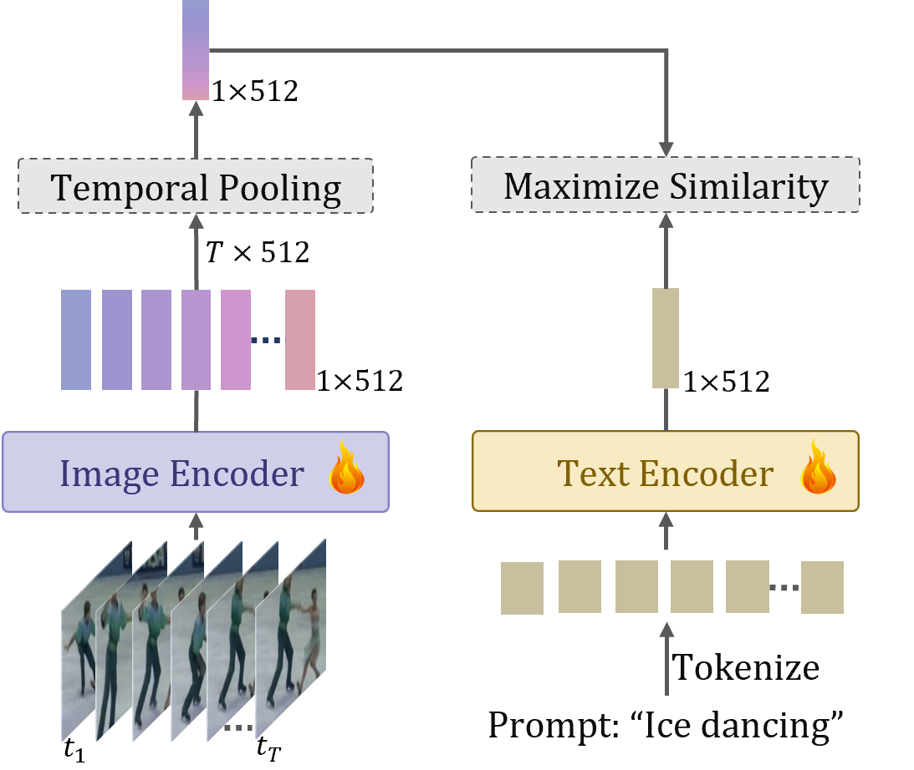
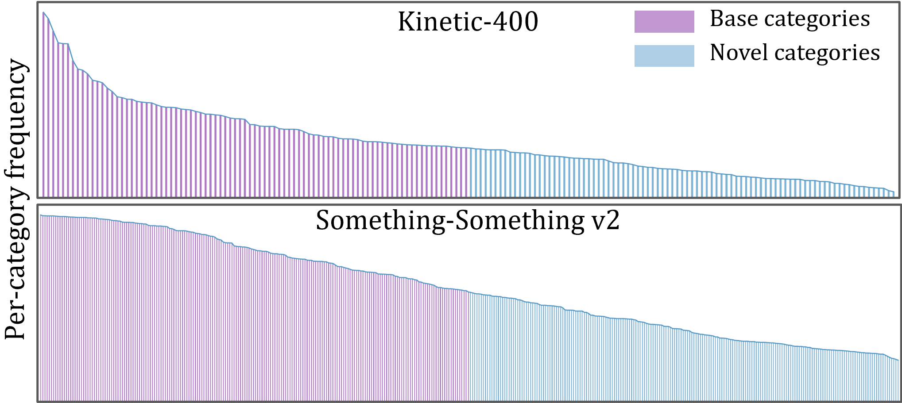
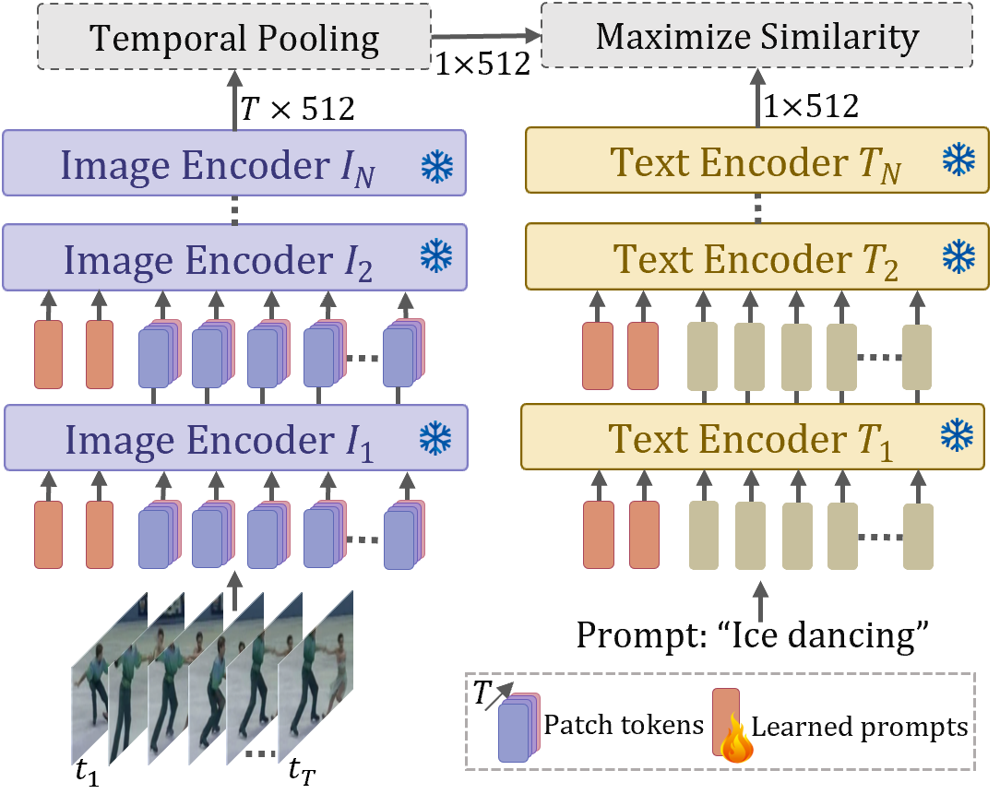
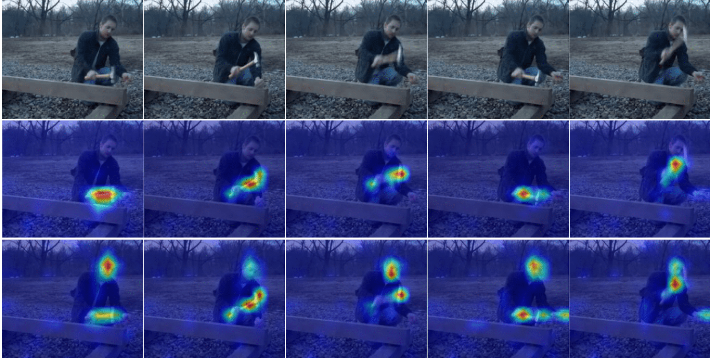

<p align="justify">  This work explores the capability of a simple baseline called ViFi-CLIP (Video Fintuned CLIP)
for adapting image pretrained CLIP to video domain. The figure compares the zero-shot performance of vanilla CLIP
and several of its variants adapted for videos (trained on Kinetics-400, evaluated on UCF-101 and HMDB-51).
The t-SNE visualizations of video-embeddings obtained from ViFi-CLIP (4th col.) are compared with embeddings
from vanilla CLIP (1st col.), individually tuned CLIP text (2nd col.) and image encoder (3rd col.) on videos,
and recent state-of-the-art work, XCLIP (last col.) (∆ represents difference over XCLIP). The embeddings of
ViFi-CLIP are better separable, indicating that a simple fine-tuning of CLIP is sufficient to learn suitable 
video-specific inductive biases, and can perform competitive to more complex approaches having dedicated components 
designed to model temporal information in videos. </p>

 
## Abstract
<p align="justify"> Large-scale multi-modal training with image-text pairs imparts strong generalization to CLIP model. Since training on a similar scale for videos is infeasible, recent approaches focus on the effective transfer of image-based CLIP to the video domain. In this pursuit, new parametric modules are added to learn temporal information and inter-frame relationships which require meticulous design efforts. Furthermore, when the resulting models are learned on videos , they tend to overfit on the given task distribution and lack in generalization aspect. This begs the following question: How to effectively transfer image-level CLIP representations to videos? In this work, we show that a simple Video Fine-tuned CLIP (ViFi-CLIP) baseline is generally sufficient to bridge the domain gap from images to videos. Our qualitative analysis illustrates that the frame-level processing from CLIP image-encoder followed by feature pooling and similarity matching with corresponding text embeddings helps in implicitly modeling the temporal cues within ViFi-CLIP. Such fine-tuning helps the model to focus on scene dynamics, moving objects and inter-object relationships. For low-data regimes where full fine-tuning is not viable, we propose a <i>bridge and prompt</i> approach that first uses fine-tuning to bridge the domain gap and then learns prompts on language and vision side to adapt CLIP representations. We extensively evaluate this simple yet strong baseline on zero-shot, base-to-novel generalization, few-shot and fully supervised settings across five video benchmarks.</p>


## Main contributions
<ul>

<li><p align="justify"><b>ViFi-CLIP:</b> We formulate and show the significance of an often neglected but simple baseline for transferring image-based CLIP model to video domain. ViFi-CLIP (Video Fintuned CLIP) shows that a simple fine-tuning of CLIP is sufficient to learn suitable video-specific inductive biases, and can perform competitive to more complex approaches having dedicated components designed to model temporal information in videos.</p></li>
<li><p align="justify"><b>Base-to-novel generalization:</b> benchmark We introduce base-to-novel generalization benchmark for video-domain for evaluating the generalization ability of models for video action recognition.</p></li>
<li><p align="justify"><b>Bridge and Prompt approach:</b> We show the effectiveness of our proposed <i>bridge and prompt</i> approach to first bridge the modality gap through fine-tuning followed by prompt learning in both visual and language branches of the CLIP model for low-data regimes.</p></li>
</ul>


## ViFi-CLIP design
<center>

<p align="justify">Overview of our simple baseline ViFi-CLIP for adapting CLIP to videos. We fine-tune CLIP on videos with minimal design changes that do not include modality specific components which we find to degrade the generalization ability of CLIP. Simple frame-level late feature aggregation via temporal pooling allows the exchange of temporal cues in the CLIP representation.</p>
 </center>

## Base-to-Novel generalization setting
<p align="justify">We introduce a <i>base-to-novel generalization</i> benchmark for video action recognition for evaluting model's generalization ability within a dataset. We split action recognition datasets into base and novel classes. The model is trained on base classes and evaluated both on base and novel classes. The proposed base and novel split categorizes the total categories into two equal halves, where the most frequently occurring classes are grouped as the base classes. Below Figure shows the base-novel splits of Kinetics-400 (K-400) and Something-Something v2 (SSv2).</p>
<center>

</center>
## Bridge and Prompt in low-data regimes

<p align="justify">We show the effectiveness of our proposed <i>bridge and prompt</i> approach to first bridge the modality gap through fine-tuning followed by prompt learning in both visual and language branches of the CLIP model for low-data regimes. Vision and Language prompts are used to fine-tune CLIP on downstream tasks. The proposed design is shown below.</p>
<center>

</center>

# Results

## Zero-shot results
<p align="justify"> All models are trained on Kinetics-400 and then evaluated directly on downstream datasets. Top-1 accuracy is reported.</p>
<center>
<table  border="0">
<tbody>
<tr>
<td><center> <b>Method</b>  </center>   </td>
<td><center> <b>Input Acc.</b>  </center>   </td>
<td><center> <b>HMDB-51</b>  </center>   </td>
<td><center> <b>UCF-101</b>  </center>   </td>
<td><center> <b>Kinetics-600</b>  </center>   </td>
</tr>
<tr>
<td>CLIP image-FT</td>
<td>32x224</td>
<td>49.0</td>
<td>72.9</td>
<td>62.2</td>
</tr>
<tr>
<td>CLIP text-FT</td>
<td> 32x224 </td>
<td> 48.5 </td>
<td> 69.8 </td>
<td> 68.5 </td>
</tr>
<tr>
<td>ViFi-CLIP</td>
<td> 32x224 </td>
<td> 51.3 </td>
<td> 76.8 </td>
<td> 71.2 </td>
</tr>
</tbody>
</table>
</center>

<br/> 


## Base-to-novel generalization results

<p align="justify">Here, we divide each dataset into base and novel classes. All models are trained on base classes and evaluated on both base and novel classes. Results are averaged over 3 seeds for each experiment. Top-1 accuracy is reported.</p>
### Kinetics-400
<center>
<table  border="0">
<tbody>
<tr>
<td><center> <b>Method</b>  </center>   </td>
<td><center> <b>Input Acc.</b>  </center>   </td>
<td><center> <b>Base Acc.</b>  </center>   </td>
<td><center> <b>Novel Acc.</b>  </center>   </td>
<td><center> <b>HM</b>  </center>   </td>
</tr>
<tr>
<td>CLIP image-FT</td>
<td>32x224</td>
<td>72.9</td>
<td>58.0</td>
<td>64.6</td>
</tr>
<tr>
<td>CLIP text-FT</td>
<td> 32x224 </td>
<td> 73.4 </td>
<td> 59.7 </td>
<td> 65.8 </td>
</tr>
<tr>
<td>ViFi-CLIP</td>
<td> 32x224 </td>
<td> 76.4 </td>
<td> 61.1 </td>
<td> 67.9 </td>
</tr>
</tbody>
</table>
</center>
### HMDB-51
<center>
<table  border="0">
<tbody>
<tr>
<td><center> <b>Method</b>  </center>   </td>
<td><center> <b>Input Acc.</b>  </center>   </td>
<td><center> <b>Base Acc.</b>  </center>   </td>
<td><center> <b>Novel Acc.</b>  </center>   </td>
<td><center> <b>HM</b>  </center>   </td>
</tr>
<tr>
<td>CLIP image-FT</td>
<td>32x224</td>
<td>62.6</td>
<td>47.5</td>
<td>54.0</td>
</tr>
<tr>
<td>CLIP text-FT</td>
<td> 32x224 </td>
<td> 70.0 </td>
<td> 51.2 </td>
<td> 59.1 </td>
</tr>
<tr>
<td>ViFi-CLIP</td>
<td> 32x224 </td>
<td> 73.8 </td>
<td> 53.3 </td>
<td> 61.9 </td>
</tr>
</tbody>
</table>
</center>
### UCF-101
<center>
<table  border="0">
<tbody>
<tr>
<td><center> <b>Method</b>  </center>   </td>
<td><center> <b>Input Acc.</b>  </center>   </td>
<td><center> <b>Base Acc.</b>  </center>   </td>
<td><center> <b>Novel Acc.</b>  </center>   </td>
<td><center> <b>HM</b>  </center>   </td>
</tr>
<tr>
<td>CLIP image-FT</td>
<td>32x224</td>
<td>86.4</td>
<td>65.3</td>
<td>74.4</td>
</tr>
<tr>
<td>CLIP text-FT</td>
<td> 32x224 </td>
<td> 90.9 </td>
<td> 67.4 </td>
<td> 77.4 </td>
</tr>
<tr>
<td>ViFi-CLIP</td>
<td> 32x224 </td>
<td> 92.9 </td>
<td> 67.7 </td>
<td> 78.3 </td>
</tr>
</tbody>
</table>
</center>
<br/>
### SSv2
<center>
<table  border="0">
<tbody>
<tr>
<td><center> <b>Method</b>  </center>   </td>
<td><center> <b>Input Acc.</b>  </center>   </td>
<td><center> <b>Base Acc.</b>  </center>   </td>
<td><center> <b>Novel Acc.</b>  </center>   </td>
<td><center> <b>HM</b>  </center>   </td>
</tr>
<tr>
<td>CLIP image-FT</td>
<td>32x224</td>
<td>9.2</td>
<td>8.5</td>
<td>8.8</td>
</tr>
<tr>
<td>CLIP text-FT</td>
<td> 32x224 </td>
<td> 12.4 </td>
<td> 9.5 </td>
<td> 10.8 </td>
</tr>
<tr>
<td>ViFi-CLIP</td>
<td> 32x224 </td>
<td> 16.2 </td>
<td> 12.1 </td>
<td> 13.9 </td>
</tr>
</tbody>
</table>
</center>
<br/>
### VL Prompting approach: Base-to-Novel
<p align="justify"> ViFi-CLIP is first trained on K400 and then vision and language prompts are further fine-tuned on the downstream datasets.</p>
<center>
<table  border="0">
<tbody>
<tr>
<td><center> <b>Dataset</b>  </center>   </td>
<td><center> <b>Input Acc.</b>  </center>   </td>
<td><center> <b>Base Acc.</b>  </center>   </td>
<td><center> <b>Novel Acc.</b>  </center>   </td>
<td><center> <b>HM</b>  </center>   </td>
</tr>
<tr>
<td>HMDB-51</td>
<td>32x224</td>
<td>77.1</td>
<td>54.9</td>
<td>64.1</td>
</tr>
<tr>
<td>UCF-101</td>
<td> 32x224 </td>
<td> 95.9 </td>
<td> 74.1 </td>
<td> 83.6 </td>
</tr>
<tr>
<td>SSv2</td>
<td> 32x224 </td>
<td> 15.8 </td>
<td> 11.5 </td>
<td> 13.3 </td>
</tr>
</tbody>
</table>
</center>
## Few-shot results
<p align="justify">Below table shows few-shot results of ViFi-CLIP for K=2, 4, 8 and 16.</p>
<center>
<table  border="0">
<tbody>
<tr>
<td><center> <b>Method</b>  </center>   </td>
<td><center> <b>Dataset</b>  </center>   </td>
<td><center> <b>K (shots)</b>  </center>   </td>
<td><center> <b>Input</b>  </center>   </td>
<td><center> <b>Top-1 Acc.</b>  </center>   </td>
</tr>
<tr>
<td>ViFi-CLIP</td>
<td>HMDB-51</td>
<td>2</td>
<td>32x224</td>
<td>57.2</td>
</tr>
<tr>
<td>ViFi-CLIP</td>
<td> HMDB-51 </td>
<td> 4 </td>
<td> 32x224 </td>
<td> 62.7 </td>
</tr>
<tr>
<td>ViFi-CLIP</td>
<td> HMDB-51 </td>
<td> 8 </td>
<td> 32x224 </td>
<td> 64.5 </td>
</tr>
<tr>
<td>ViFi-CLIP</td>
<td> HMDB-51 </td>
<td> 16 </td>
<td> 32x224 </td>
<td> 66.8 </td>
</tr>
<tr>
<td>ViFi-CLIP</td>
<td> UCF-101 </td>
<td> 2 </td>
<td> 32x224 </td>
<td> 80.7 </td>
</tr>
<tr>
<td>ViFi-CLIP</td>
<td> UCF-101 </td>
<td> 4 </td>
<td> 32x224 </td>
<td> 85.1 </td>
</tr>
<tr>
<td>ViFi-CLIP</td>
<td> UCF-101 </td>
<td> 8 </td>
<td> 32x224 </td>
<td> 90.0 </td>
</tr>
<tr>
<td>ViFi-CLIP</td>
<td> UCF-101 </td>
<td> 16 </td>
<td> 32x224 </td>
<td> 92.7 </td>
</tr>
<tr>
<td>ViFi-CLIP</td>
<td> SSv2 </td>
<td> 2 </td>
<td> 32x224 </td>
<td> 6.2 </td>
</tr>
<tr>
<td>ViFi-CLIP</td>
<td> SSv2 </td>
<td> 4 </td>
<td> 32x224 </td>
<td> 7.4 </td>
</tr>
<tr>
<td>ViFi-CLIP</td>
<td> SSv2 </td>
<td> 8 </td>
<td> 32x224 </td>
<td> 8.5 </td>
</tr>
<tr>
<td>ViFi-CLIP</td>
<td> SSv2 </td>
<td> 16 </td>
<td> 32x224 </td>
<td> 12.4 </td>
</tr>
</tbody>
</table>
</center>
<br/>
NOTE: Few-shot results for other CLIP Fine-tuned variants are presented in our main paper (Table 3).
### VL Prompting approach: Few-shot
ViFi-CLIP is first trained on K400 and then vision and language prompts are further fine-tuned on the downstream datasets in few-shot manner.
<center>
<table  border="0">
<tbody>
<tr>
<td><center> <b>Dataset</b>  </center>   </td>
<td><center> <b>Input</b>  </center>   </td>
<td><center> <b>K=2</b>  </center>   </td>
<td><center> <b>K=4</b>  </center>   </td>
<td><center> <b>K=8</b>  </center>   </td>
<td><center> <b>K=16</b>  </center>   </td>
</tr>
<tr>
<td>HMDB-51</td>
<td>32x224</td>
<td>63.0</td>
<td>65.1</td>
<td>69.6</td>
<td>72.0</td>
</tr>
<tr>
<td>UCF-101</td>
<td> 32x224 </td>
<td> 91.0 </td>
<td> 93.7 </td>
<td> 95.0 </td>
<td> 96.4 </td>
</tr>
<tr>
<td>SSv2</td>
<td> 32x224 </td>
<td> 6.7 </td>
<td> 7.9 </td>
<td> 10.2 </td>
<td> 13.5 </td>
</tr>
</tbody>
</table>
</center>
## Fully-supervised results on Kinetics-400
<center>
<table  border="0">
<tbody>
<tr>
<td><center> <b>Method</b>  </center>   </td>
<td><center> <b>FLOPS(G)</b>  </center>   </td>
<td><center> <b>Input</b>  </center>   </td>
<td><center> <b>Top-1 Acc.	</b>  </center>   </td>
<td><center> <b>Top-5 Acc.	</b>  </center>   </td>
</tr>
<tr>
<td>CLIP image-FT</td>
<td>281</td>
<td>16x224</td>
<td>82.8</td>
<td>96.2</td>
</tr>
<tr>
<td>CLIP text-FT</td>
<td> 281 </td>
<td> 16x224 </td>
<td> 73.1 </td>
<td> 91.2 </td>
</tr>
<tr>
<td>ViFi-CLIP</td>
<td> 281 </td>
<td> 16x224 </td>
<td> 83.9 </td>
<td> 96.3 </td>
</tr>
</tbody>
</table>
</center>
## Visualizations

### Attention map visualizations 

<p align="justify">Attention map visualizations of ViFi-CLIP in comparison with vanilla CLIP on two examples from UCF-101 validation set.
ViFi-CLIP learns inter-object relationships and scene-dynamics from temporal cues and focuses on fast-moving parts and objects, thereby
demonstrating the ability to encode video specific information. 
</p>



### Generalization to out-of-distribution examples

<p align="justify">Attention map visualizations from ViFi-CLIP shows impressive generaliza-
tion. (Left): Visualization on a diffusion model generated (synthetic) video from Imagen [1] shows how ViFi-CLIP focuses on the body
of the astronaut, the horse and its moving feet. (Right): Example of a rare scenario <i>giraffe diving</i>. ViFi-CLIP consistently attends to
the giraffe at various locations: diving board, air, water-surface and under the pool. </p>


## References
[1] Saharia, Chitwan, et al. "Photorealistic Text-to-Image Diffusion Models with Deep Language Understanding." arXiv preprint arXiv:2205.11487 (2022).

## BibTeX
If you like our work, please consider citing us.
```
@article{hanoona2022vificlip,
    title={Finetuned CLIP models are efficient video learners},
    author={Rasheed, Hanoona and khattak, Muhammad Uzair and Maaz, Muhammad and Khan, Salman and Khan, Fahad Shahbaz},
    journal={arXiv:},
    year={2022}
}
```
